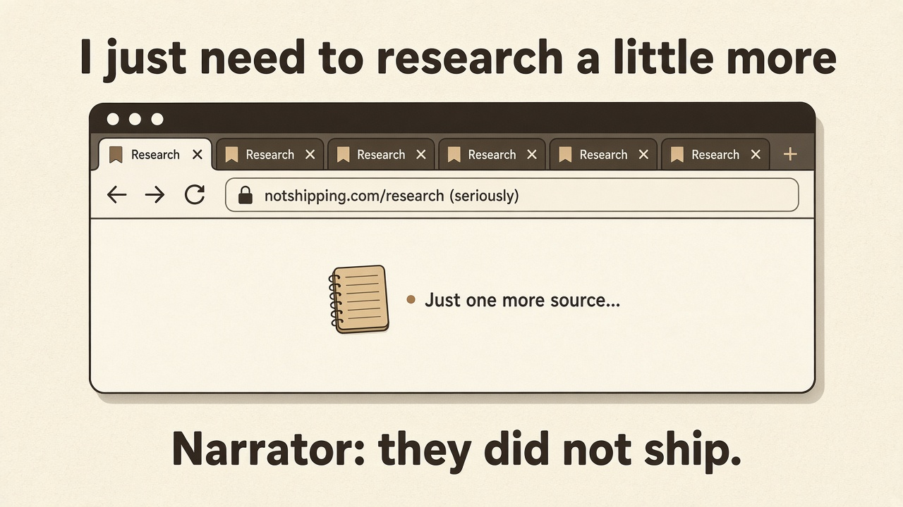

# Ideator Weekly — Issue 3

**Date:** 2026-09-20  
**Collection:** starters · bot handoffs · one experiment · one meme

---

## Ideation starters

**1. Question storm**  
Ask 20 dumb questions about the idea before any answers. Quantity first — insight often hides around question #14.

**2. Steal the ritual, not the product**  
What’s a daily ritual people already do (coffee, commute, Sunday reset)? Hitch the idea to that ritual instead of inventing a new habit.

---

## Bot can do what!?

**1. Ugly Prototype pack**  
Say “Prototype this.” Your bot writes the goal in *your* words, what done looks like, and who the next human is — no repo, no launch theater.

**2. Ass-kick for five weekdays**  
Lock one next move. The bot nags (shy of intolerable) for five days, then asks what actually moved.

*(Voice-back + skeptic customer are table stakes for Ideator — not the surprise.)*

---

## Coaching experiment (this week only)

**Mechanism:** one variable · seven days · no “failure,” only data.

**This week’s variable:** Five times a day, without changing the task — *how do I enjoy this 5–10% more?*  
(Joe Hudson / Art of Accomplishment · via My First Million)

---

## Zeitgeist meme

---

*Issue 3 — a collection, not a changelog.*
